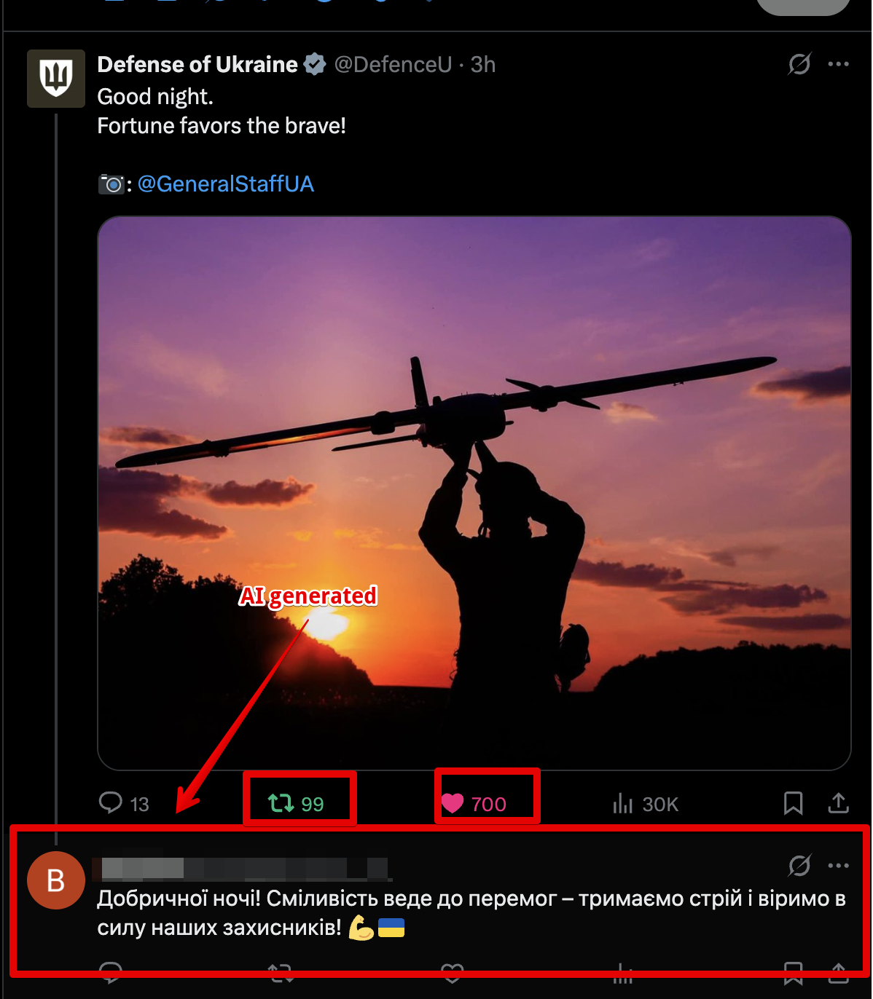
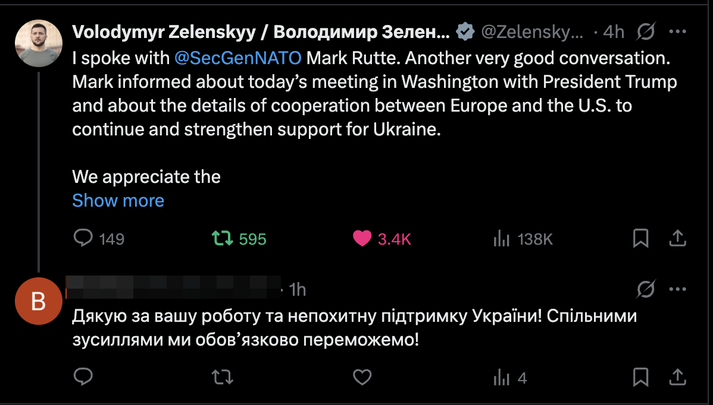
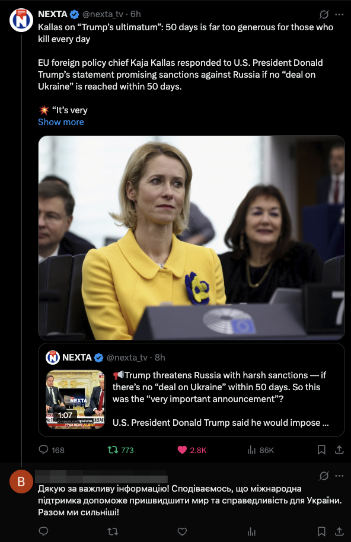

# Twitter Bot Automation

Readme is split into three parts:

1. Introduction
2. How to run
3. Results


## Introduction

This project provides an automated Twitter interaction system powered by configurable “bots.” It uses a PostgreSQL database to manage bot credentials and store tweets. Passwords are securely hashed before storage. Once a bot is registered via the provided creation script, you can run the bot by its predefined name. The bot will:

1. Scrape a specified number of tweets from Twitter.
2. Identify the most viral tweets based on engagement metrics.
3. Perform actions such as liking, retweeting, and replying.
4. Store raw and processed tweet data in the database.
5. Generate AI-driven responses by calling the OpenAI API via LangChain, with observability provided by LangSmith (tracking tokens, costs, and logs).

All components run inside Docker containers, including a headless browser for scraping and a PostgreSQL instance for data storage.


## How to run 

Follow these steps to set up and run the Twitter Bot Automation using the provided scripts and Docker setup.

### 1. Copy and Configure Environment Variables

Rename the example file and open it for editing:

```bash
cp env_example .env
```

Populate .env with your credentials and settings:

```bash
POSTGRES_USER=postgres
POSTGRES_PASSWORD=postgres
POSTGRES_DB=twitter_db
POSTGRES_PORT=5432
DATABASE_URL=postgresql+asyncpg://$(POSTGRES_USER):$(POSTGRES_PASSWORD)@db:5432/$(POSTGRES_DB)
FERNET_KEY=<your_fernet_key>
TWITTER_LOGIN=<twitter_login>
TWITTER_PASSWORD=<twitter_password>
OPENAI_API_KEY=<your_openai_api_key>
LANGSMITH_API_KEY=<your_langsmith_api_key>
```

### 2. Build and Launch Docker Services

Use the Makefile targets to orchestrate Docker:

```bash
make build
make up
```

Verify that the services are running:

```bash
docker compose ps
```

### 3. Apply Database Migrations

Run Alembic migrations to create the `bots` and `tweets` tables:

```bash
make apply-migrations
```

> **Note:** The migration script lives under `alembic/versions/3caa6e451516_initial.py`.

### 4. Register a New Bot

Use the helper script to create a bot record (password will be hashed):

```bash
make create-bot BOT_NAME=<name> USERNAME=<display_name> LOGIN=<twitter_login> PASSWORD=<plaintext_password>
```

Example:

```bash
make create-bot BOT_NAME=news_bot USERNAME=NewsBot LOGIN=news_account PASSWORD=SuperSecret123
```

### 5. Run Your Bot

Specify which bot to run and how many tweets to process:

```bash
# Default max tweets = 8
make run-bot BOT_NAME=<name>

# Override max tweets (e.g. 50 tweets)
make run-bot BOT_NAME=<name> MAX_TWEETS=50
```

Under the hood, this invokes:

```bash
docker compose run --rm app \
  uv run -m src.run_bot \
    --bot-name <name> \
    --max-tweets <n>
```

Once invoked, the bot will:

- Launch a headless browser via Playwright
- Authenticate and scrape the home timeline
- Identify the most viral tweet
- Perform likes, retweets, and replies
- Persist tweet and reply data in PostgreSQL

## Results

### 1. Bot actions 

After scrapping and determing the most viral tweet, the bot will perform the following actions:

1. Like the tweet
2. Retweet the tweet
3. Reply to the tweet


### 2. Examples of tweets and replies
1. Tweet + Reply example 1:


2. Tweet + Reply example 2:


3. Tweet + Reply example 3:

